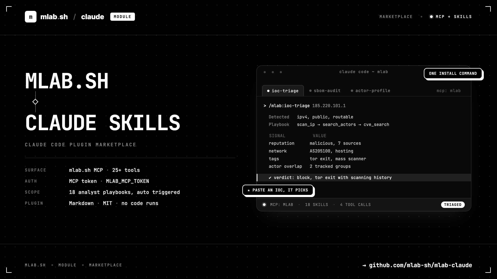

# mlab-claude

Official [Claude Code](https://code.claude.com) plugin marketplace for [mlab.sh](https://mlab.sh) - threat intelligence workflows for SOC and DFIR teams, directly in your terminal.

> Investigate threats, not noise.



## What you get

Installing the `mlab` plugin gives Claude Code two things at once:

1. **The mlab.sh MCP server** - 25+ tools for IOC lookups (IP, domain, URL, hash, email, crypto, phone, MAC), CVE search, threat actor intelligence, SBOM scanning and smishing scoring.
2. **Analyst playbooks (skills)** - opinionated workflows that teach Claude how a SOC analyst chains those tools: how to pivot from an indicator to an actor, how to prioritize CVEs by KEV/EPSS, what an analyst-ready report looks like.

### Skills

| Skill | What it does |
|---|---|
| `/mlab:ioc-triage` | Triage any single indicator: type detection, the right scans, actor/CVE pivots, structured verdict. |
| `/mlab:ioc-batch` | Bulk-enrich a list of IOCs with quota management; CSV output ready for blocklists/MISP. |
| `/mlab:script-triage` | Statically vet a suspicious shell script: dangerous constructs, extracted IOCs, enrichment. |
| `/mlab:sbom-audit` | Scan a lockfile/SBOM for vulnerabilities, prioritize by KEV and EPSS, attribute actively exploited CVEs to actors. |
| `/mlab:actor-profile` | Build a threat actor brief: origin, targeting, aliases, ATT&CK tradecraft, exploited CVEs. |
| `/mlab:phishing-triage` | Analyze a suspicious email or SMS: sender reputation, spoofability, link analysis, smishing score. |
| `/mlab:smishing-campaign` | Cluster a batch of reported SMS into campaigns and extract the shared infrastructure. |
| `/mlab:crypto-trace` | Triage blockchain addresses: sanctions, labels, risk, with correct EVM chain handling. |
| `/mlab:domain-surface` | Review a domain's external surface: subdomains, DNS, certs, mail spoofability. |
| `/mlab:threat-watch` | Digest of recent critical/KEV CVEs filtered to your declared stack, with actor attribution. |
| `/mlab:case-notes` | Persistent investigation journal: mlab bookmarks for indicators + local case file for the narrative. |
| `/mlab:intel-report` | Turn a finished investigation into a client-ready CTI report (TLP, confidence levels, defanged IOC annex). |

Six more skills pair the MCP tools with [postmortem](https://github.com/mlab-sh/postmortem), mlab's local supply-chain scanner (a single static binary; the skills check it is installed and offer install instructions if not):

| Skill | What it does |
|---|---|
| `/mlab:supply-chain-audit` | Full project audit: postmortem detects malicious deps locally, mlab attributes what it finds. |
| `/mlab:dep-diff-review` | Review what a PR or change introduces: new packages, typosquats, install scripts, vulns. |
| `/mlab:dep-vetting` | "Can I trust this package?" before adding it: history, maintainers, blast radius, scripts. |
| `/mlab:repo-ioc-sweep` | "This repo talks to whom?" Extract and enrich every endpoint embedded in a codebase. |
| `/mlab:sbom-export` | Generate a CycloneDX SBOM locally (projects or container images), scan it via mlab. |
| `/mlab:license-check` | License inventory and policy enforcement over the dependency graph. |

Skills also trigger automatically: paste an IP or a suspicious SMS into Claude Code and it will pick the right playbook on its own.

## Installation

### 1. Get an mlab.sh MCP token

Create a token (starts with `mcp_`) from your [mlab.sh](https://mlab.sh) account, then export it:

```bash
export MLAB_MCP_TOKEN="mcp_xxxxxxxx"
```

Add it to your shell profile to make it permanent. The plugin's MCP configuration reads this variable.

### 2. Install the plugin

In Claude Code:

```
/plugin marketplace add mlab-sh/mlab-claude
/plugin install mlab@mlab-sh
```

That's it. Verify with `/mcp` (the `mlab` server should be listed) and try:

```
/mlab:ioc-triage 185.220.101.1
```

## Repository structure

```
.
├── .claude-plugin/
│   └── marketplace.json          # Declares this repo as a plugin marketplace
├── plugins/
│   └── mlab/                     # The mlab plugin
│       ├── .claude-plugin/
│       │   └── plugin.json       # Plugin manifest
│       ├── .mcp.json             # mlab.sh MCP server config (https://mlab.sh/mcp)
│       ├── docs/
│       │   ├── tool-reference.md # Verified API output shapes and gotchas, shared by all skills
│       │   └── postmortem-reference.md # Verified postmortem CLI map, shared by the local skills
│       └── skills/
│           ├── ioc-triage/SKILL.md
│           ├── ioc-batch/SKILL.md
│           ├── script-triage/SKILL.md
│           ├── sbom-audit/SKILL.md
│           ├── actor-profile/SKILL.md
│           ├── phishing-triage/SKILL.md
│           ├── smishing-campaign/SKILL.md
│           ├── crypto-trace/SKILL.md
│           ├── domain-surface/SKILL.md
│           ├── threat-watch/SKILL.md
│           ├── case-notes/SKILL.md
│           ├── intel-report/SKILL.md
│           ├── supply-chain-audit/SKILL.md
│           ├── dep-diff-review/SKILL.md
│           ├── dep-vetting/SKILL.md
│           ├── repo-ioc-sweep/SKILL.md
│           ├── sbom-export/SKILL.md
│           └── license-check/SKILL.md
└── README.md
```

One marketplace can host several plugins; today it ships one (`mlab`). Future plugins land as new directories under `plugins/` plus an entry in `marketplace.json`.

## How skills work

Each skill is a folder with a `SKILL.md`: YAML frontmatter (the `description` tells Claude *when* to use it) followed by markdown instructions (the playbook: which tools, in what order, with which output format). No code runs from a skill; it is context that shapes how Claude uses the MCP tools.

To add a skill: create `plugins/mlab/skills/<name>/SKILL.md`, write a precise `description` (this is what drives auto-invocation), and keep the playbook prescriptive - tool names, decision tables, an explicit report template. Every skill points to `docs/tool-reference.md`, the shared field-level reference verified against the live API: when the API changes or a new gotcha is found, fix it there once.

## Development

Test your local checkout without pushing:

```
/plugin marketplace add /path/to/mlab-claude
/plugin install mlab@mlab-sh
```

After edits, reinstall or run `/plugin marketplace update mlab-sh`.

## Links

- mlab.sh platform: https://mlab.sh
- MCP integration docs: https://doc.mlab.sh/docs/mlab.sh/integrations/mcp
- Claude Code plugin docs: https://code.claude.com/docs/en/plugins.md

## License

MIT
